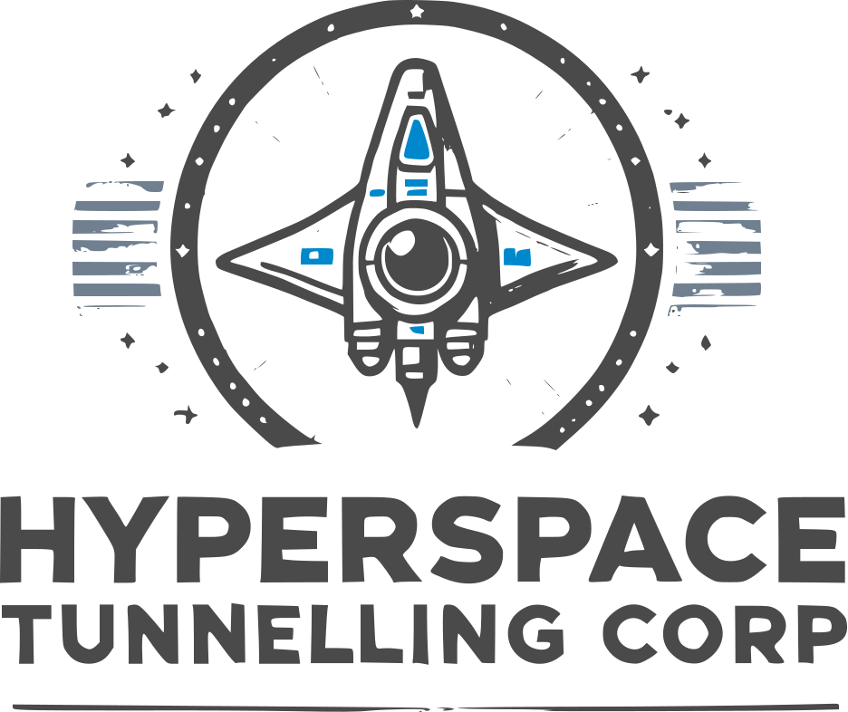

<div align="center"></div>

## Background

Welcome Hyperspace Tunnelling Corp this project is built with blood, sweat and tears.
The project is design to allow agent workers to view, assign and checkin passengers to starships.

It uses the following resources

- https://fakerapi.it/api/v2/persons for faking the passenger data
- https://robohash.org for randomly generating avatar images
- Local storage to save the state of passengers that require assigning and checking in

## Getting Started

First, run the development server:

```bash
yarn install
yarn dev
```

Open [http://localhost:3000](http://localhost:3000) with your browser to see the result.

## Whats next

- Increase total test coverage as currently its 💩
- Add toastify for when a passenger gets assigned, removed and other errors
- Speak to Nasa to see they want to use this for there next space mission.....

## Known bugs 🐛

- 2 notifications are displayed when checking in a user
